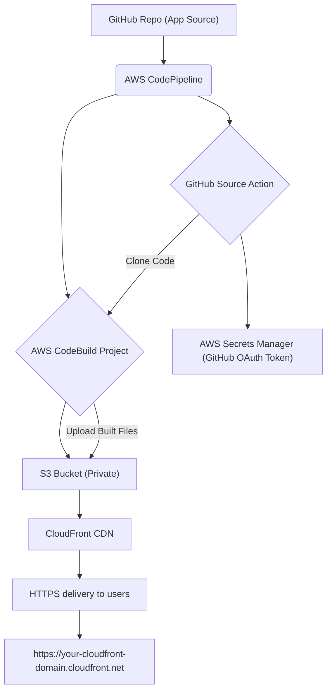

# Static Website Deployment with AWS CDK

This project uses AWS CDK to deploy a static website hosting solution on AWS, featuring an S3 bucket for content storage, a CloudFront distribution for global delivery, and a CI/CD pipeline using AWS CodePipeline and CodeBuild triggered by GitHub.

## Architecture

The architecture implemented by this CDK stack is as follows:



## Prerequisites

*   [AWS Account](https://aws.amazon.com/free/)
*   [AWS CLI configured with credentials and a default region](https://docs.aws.amazon.com/cli/latest/userguide/cli-configure-quickstart.html)
*   [Node.js and npm](https://nodejs.org/)
*   [AWS CDK Toolkit installed (`npm install -g aws-cdk`)](https://docs.aws.amazon.com/cdk/latest/guide/getting_started.html)
*   A GitHub repository containing your static website code.
*   A GitHub Personal Access Token with `repo` and `admin:repo_hook` permissions.

## Setup

1.  **Clone the repository:**

    ```bash
    git clone YOUR_REPO_URL
    cd static-website-cdk
    ```

2.  **Install dependencies:**

    ```bash
    npm install
    ```

3.  **Bootstrap CDK (if you haven't already in this account/region):**

    ```bash
    cdk bootstrap aws://YOUR_ACCOUNT_ID/YOUR_AWS_REGION
    ```
    Replace `YOUR_ACCOUNT_ID` and `YOUR_AWS_REGION` with your AWS account ID and preferred region.

4.  **Create a GitHub Personal Access Token Secret in AWS Secrets Manager:**

    Create a secret in AWS Secrets Manager with the name `static-website-deploy-github-token-poc` (or the name specified in `config/config.ts`) and store your GitHub Personal Access Token as the secret value.

    You can use the AWS CLI:
    ```bash
    aws secretsmanager create-secret --name "static-website-deploy-github-token-poc" --secret-string "YOUR_GITHUB_TOKEN"
    ```
    Replace `YOUR_GITHUB_TOKEN` with the actual token value.

5.  **Update Configuration:**

    Edit the `config/config.ts` file to update the `github` section with your repository details:

    ```typescript
    github: {
      owner: 'YOUR_GITHUB_OWNER',
      repo: 'YOUR_REPO_NAME',
      branch: 'main', // Or your desired branch
    },
    ```

## Deployment

1.  **Synthesize the CloudFormation template:**

    ```bash
    cdk synth
    ```
    Review the output to see the AWS resources that will be created.

2.  **Deploy the stack:**

    ```bash
    cdk deploy
    ```
    The CDK will provision the S3 bucket, CloudFront distribution, CodeBuild project, and CodePipeline.

## Post-Deployment

Once the deployment is complete:

*   The CodePipeline will automatically start, fetch your code from GitHub, build it using CodeBuild, and deploy the static assets to the S3 bucket.
*   The static website will be available via the CloudFront distribution domain name, which is outputted by the `cdk deploy` command.
*   Requests to sub-paths like `/about` will be rewritten by the CloudFront Function to serve the corresponding `index.html` file from the S3 bucket (e.g., `about/index.html`).

## Cleaning Up

To remove all deployed resources, run:

```bash
cdk destroy
```

**Note:** The S3 bucket for website assets is configured with `removalPolicy: cdk.RemovalPolicy.DESTROY` and `autoDeleteObjects: true` for easy cleanup in development. For production environments, adjust these settings to retain data or prevent accidental deletion.
